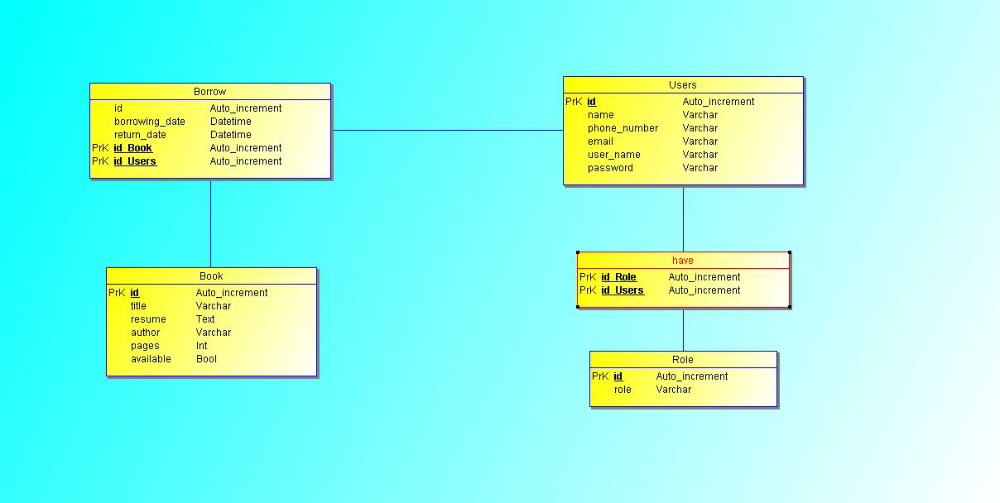

# Library Management API

For this project, we start from this model.

## Who uses the app?

The application is used by two users:
- Administrator: Who manages the library.
- Client

## Authorization?
### For admin:
The admin is allowed to do all possible manipulations.

- Book
  - Add books
  - See the list of books
  - Update book information

- User
  - View users
  - Delete a user

## For client:
customers are allowed to a:

- Book
  - See the list of books
  - Borrow books

- User
  - Read & Update own information
  - Delete his compte